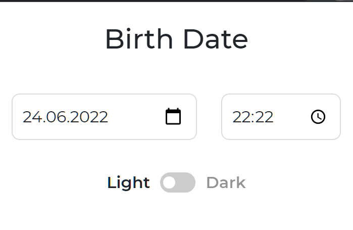

#  Actual Age Chrome Extension

Displaying actual age in percentage with 9 signs after dot (floating number)

## Features

### Popup
*You can select your Birth date & time. Finite number will be reckoned from date what you chosen*

### New tab override
*Core component which display your actual age*

### Phrases
*Popup display random motivational phrase*

## Install

[**Chrome** extension]() <!-- TODO: Add chrome extension link inside parenthesis -->
